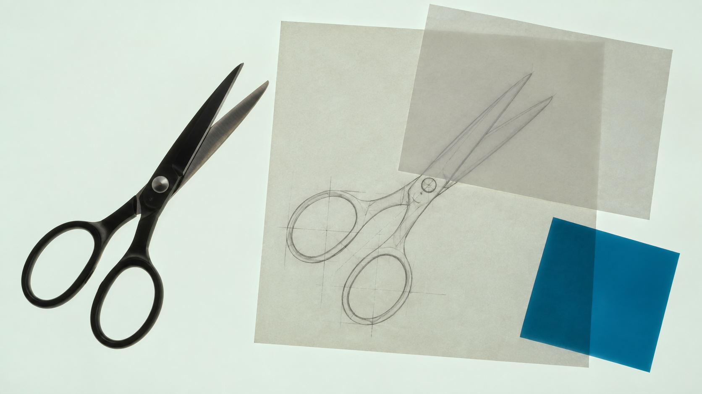
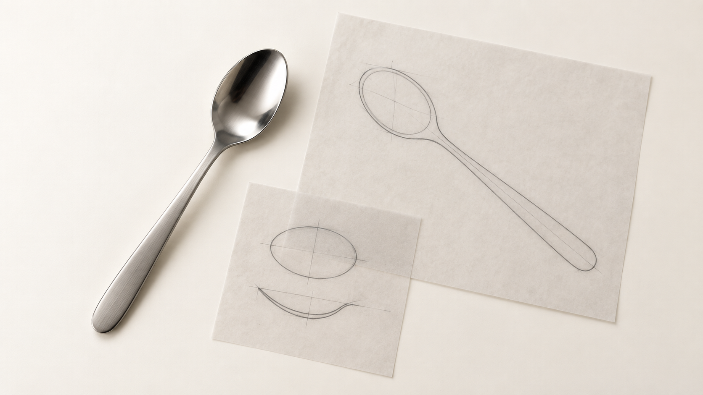
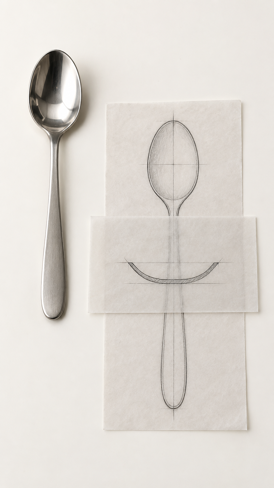

# Siuyu Lightbox Still Life

**用光台静物图，呈现物件的结构与质感。**

Siuyu Lightbox Still Life 是一个在 Codex 中使用的图像创作 Skill。你可以上传物件照片和风格参考，也可以从文字想法开始。它会根据你的要求设计构图，调用图像工具生成图片，再检查画面中的结构、光线和材料细节。

默认采用从光台正上方俯拍的构图，把主体与对应的图稿、材料样片放在一起。光线从下方穿过纸张和薄片，物件的轮廓、表面与纸层的交叠成为画面的重点。你也可以选择单件主视觉、操作场景或材质特写。

调用名：`$siuyu-lightbox-still-life` · 作者：siuyu · 版本：`1.0.0-rc.1`

[快速安装](#快速安装) · [开始生成](#开始生成) · [查看完整图库](references/example-gallery.md) · [素材来源](ASSET_SOURCES.md)



*光从下方透过硫酸纸。两张纸交叠的区域更暗，被覆盖的铅笔线条也更淡，剪刀表面仍能看见金属反光。这张图使用两张用户提供的图片作为光线参考，详见 [配图来源](ASSET_SOURCES.md)。*

## 快速安装

已安装 Node.js 和 npm 时，可在终端运行：

```bash
npx skills add https://github.com/masiuyu/siuyu-lightbox-still-life --skill siuyu-lightbox-still-life
```

安装时选择 Codex，完成后在新对话中使用 `$siuyu-lightbox-still-life`。运行这套流程需要 Python 3.10 或更新版本，以及图片查看和图像生成工具，详见 [运行环境与其他安装方式](#运行环境与其他安装方式)。

也可以直接请 Codex 安装：

```text
请从 https://github.com/masiuyu/siuyu-lightbox-still-life 安装这个 Skill。
先读取仓库说明，运行包校验，再安装到我的 Codex Skills 目录。
如果已有同名版本，先完整备份。完成后告诉我实际安装位置和调用方式。
```

已经下载 ZIP 时，可以把上面的仓库地址换成解压目录。

## 开始生成

有明确的物件时，附上照片，并说明你希望怎样呈现它：

```text
使用 $siuyu-lightbox-still-life，根据附件生成一张 16:9 的光台研究静物图。
从台面正上方俯拍，保留主体的实际结构，在旁边安排对应的轮廓图和材料样片。
硫酸纸平铺在透光台面上，光从下面穿过纸张，交叠处的明暗差别清楚。
台面铺满画面四周，主体和图稿完整入镜，物件之间留出间距。
请实际生成图片，并打开结果检查。
```

还没有照片时，可以先描述想做的物件：

```text
使用 $siuyu-lightbox-still-life，自主设计一张 9:16 的玻璃杯材料研究图。
杯子的开口、杯壁、杯底和把手都要清楚可辨。
在杯子旁边安排轮廓图、玻璃样片和透光纸层，展示杯子的结构与玻璃的透光效果。
```

## 五种画面方向

| 画面方向 | 适合怎样的画面 |
|---|---|
| 底光透射 | 光线从下方穿过纸张和透明薄片，交叠处更暗，实体物件保留自身的表面与暗部。 |
| 柔光纸层 | 乳白台面上铺着描图纸，用柔和光线呈现纸张纹理，以及下层线条透过上层纸张的效果。 |
| 色场主视觉 | 用大面积的统一底色衬托物件，例如以蓝灰色台面突出白瓷杯的轮廓与明暗。 |
| 工作台动作 | 把描图、摆放或手持纸稿的动作放入画面，表现手、工具与物件的实际接触。 |
| 材质近摄 | 靠近物件，观察金属反光、拉丝纹理或纸张纤维，围绕指定细节安排取景。 |

你可以按表中的方向提出要求，也可以直接描述想看到的画面。图稿、样片和摆放方式会围绕本次主体设计。

## 横幅与竖幅，分别构图

| 16:9 横幅 | 9:16 竖幅 |
|---|---|
|  |  |

横幅和竖幅各自安排主体、图稿与纸层的位置。制作一组图片时，可以保持物件、材料和色调一致，再根据画幅调整分组和间距。

## 随包提供的案例

图库收录九组主题，每组各有一张横幅和一张竖幅，共十八张图片。你可以在 [完整图库](references/example-gallery.md) 中并排查看构图，并打开每张图的生成记录和看图记录。

| 案例 | 观察重点 |
|---|---|
| [玻璃杯透光研究](references/example-gallery.md#example-01) | 杯口、杯底和把手怎样连接，玻璃样片叠放后怎样透光。 |
| [咖啡勺轮廓与纸层](references/example-gallery.md#example-02) | 勺子的轮廓怎样对应纸上的石墨图稿。 |
| [瓷杯色场主视觉](references/example-gallery.md#example-03) | 蓝灰色台面怎样衬托白瓷杯与杯碟。 |
| [咖啡勺描绘操作](references/example-gallery.md#example-04) | 一只手压住纸张，另一只手握笔描绘时的接触位置。 |
| [咖啡勺表面近摄](references/example-gallery.md#example-05) | 勺碗的抛光反射与长柄的拉丝纹理。 |
| [咖啡勺工艺比较](references/example-gallery.md#example-06) | 抛光钢片、拉丝钢片和纸上铅笔排线之间的比较。 |
| [手持咖啡勺图稿](references/example-gallery.md#example-07) | 双手托起纸稿时的纸张弯曲，以及下层线条在覆盖区域内外的深浅。 |
| [棉纸字形压纹](references/example-gallery.md#example-08) | 字母压纹的深浅、纸张纤维与切边。 |
| [柔光箱透光纸层](references/example-gallery.md#example-09) | 单层纸与叠层纸的明暗差别，以及跨过纸边界的铅笔线条。 |

## 它怎样工作

1. **确认主体与参考用途。** 查看本轮附件，确认物件的部件和外形，以及各张参考用于说明什么。只有文字要求时，先确定要呈现的物件及其结构。
2. **设计并生成画面。** 安排光线、材料和物件的位置，将这些选择保存为方向记录，编译成图像任务，再调用当前环境的图像生成工具。
3. **打开图片检查。** 核对主体结构、纸层透光和构图，再检查物件与台面的接触，以及操作场景中手与工具的位置。有具体问题时，再据此调整画面。

常规交付包含生成图片、画面方向、实际成像任务和简短的看图记录。图片生成情况、视觉检查结果和你的审阅意见分别记录，方便继续修改。

## 几种实用请求

**保留产品的外形和材料特点：**

```text
使用 $siuyu-lightbox-still-life，把附件中的产品做成光台材料研究图。
保留产品的实际结构和颜色，纸上图稿与产品轮廓对应，
材料样片选用与产品表面相符的材质。
```

**制作一组横幅和竖幅：**

```text
使用 $siuyu-lightbox-still-life，为同一主体分别设计一张 16:9 和一张 9:16 的图片。
两张图保持材料和色调一致，根据各自的画幅安排物件、纸层和周围的留白。
```

**调整已有图片的透光效果：**

```text
使用 $siuyu-lightbox-still-life，继续修改这一版。
保持主体与图稿的位置，增强光线从下方穿过硫酸纸的效果。
两张纸交叠的位置要比单层更暗，被盖住的铅笔线条要更淡。
请查看修改后的图片，核对这两处变化。
```

## 运行环境与其他安装方式

### 运行环境

Skill 提供构图流程、提示词编译和检查脚本，图像生成能力由运行它的环境提供。

| 用途 | 所需条件 |
|---|---|
| 在 Codex 中生成和检查图片 | 本地文件读写、图片查看和内置图像生成工具 |
| 通过 `npx skills` 安装 | Node.js 与 npm |
| 编译画面方向、检查记录 | Python 3.10 或更新版本，脚本使用标准库 |
| 使用本地确定性渲染流程 | 另行准备配套渲染器工程，见 [离线工作流](references/offline-workflow.md) |

已验证的使用环境是 Codex。其他 Agent 需要按自身工具接口适配，兼容情况以实际验证为准。

### 克隆仓库安装

```bash
git clone https://github.com/masiuyu/siuyu-lightbox-still-life.git
cd siuyu-lightbox-still-life
python3 scripts/validate_skill.py .
python3 scripts/install_skill.py
```

### 从压缩包安装

下载仓库 ZIP 后，解压并进入包含 `SKILL.md` 的目录，再运行：

```bash
python3 scripts/validate_skill.py .
python3 scripts/install_skill.py
```

### 安装位置与更新

安装脚本默认将 Skill 放到 `~/.codex/skills/siuyu-lightbox-still-life`。如果设置了 `CODEX_HOME`，则安装到该目录下的 `skills/siuyu-lightbox-still-life`。安装后重新加载 Skills，或重新打开 Codex，再用 `$siuyu-lightbox-still-life` 调用。

更新已有版本时，在仓库目录中运行：

```bash
python3 scripts/install_skill.py --backup-existing
```

脚本会把旧版本完整保存在 Skills 目录旁的 `skill-backups/` 中，并输出实际保存位置。需要自选安装位置时，在安装命令后加上 `--target-root /path/to/skills`。

手动安装时，也可以把整个 Skill 目录复制到自己的 Codex Skills 目录下，并将文件夹命名为 `siuyu-lightbox-still-life`。

## 包内结构

```text
siuyu-lightbox-still-life/
├── SKILL.md                 # Agent 执行本 Skill 的说明
├── README.md                # 介绍与使用方法
├── ASSET_SOURCES.md         # 配图来源
├── agents/openai.yaml       # 名称、图标与默认调用
├── assets/                  # 配置样例、摄影预设与生成图片
├── references/              # 图库，以及构图、光线、结构和检查方法
├── scripts/                 # 安装、编译和检查脚本
└── evals/                   # 行为评估场景
```

## 常见问题

**一定要上传照片吗？** 如果想保留某件物品的外形，请上传它的照片；如果是探索新的设计，可以从文字开始。附上多张参考时，请说明哪张用于确认物件结构，哪张用于参考光线、颜色或构图。

**能指定比例和像素尺寸吗？** 默认横幅为 16:9，竖幅为 9:16，也接受其他比例或目标像素尺寸。实际尺寸取决于图像工具的输出，交付记录会注明。随包案例的原生尺寸为 1672×941 或 941×1672，与目标比例有像素取整造成的细小差异。

**每次都会采用同样的摆法吗？** 摄影预设提供光线和材料的处理方式，具体物件、图稿和布局根据本次要求设计。修改已有图片时，可以说明哪些位置、颜色或材料需要保持。

**案例图片可以下载吗？** 可以。十九张生成图片随仓库保存在 `assets/` 中，克隆或下载 ZIP 后即可在本地查看，生成来源见 [素材来源](ASSET_SOURCES.md)。

## 配图与发布信息

随包的十九张静物图片均由 AI 图像工具生成。九组横竖案例依据文字描述生成，底光硫酸纸展示图使用了两张用户提供的光线参考。各图的来源和生成记录见 [素材来源](ASSET_SOURCES.md)。当前版本为 `1.0.0-rc.1`。
