# 配套示例图库

以下案例按主题并排展示横竖构图。另见 [底光硫酸纸展示图](../assets/showcase/transmitted-paper.png) 及其 [来源记录](../assets/showcase/provenance.json)，观察明亮台面、深色实体与纸层透射密度的关系。安装与用法见 [项目介绍](../README.md)。

九组、十八张实际成图，以熟悉的现实器物演示五种摄影预设、两个方向候选、纸层场景变体和柔光箱透光面。每组分别设计横幅与竖幅。

图片由本轮文字概念经内置图像工具生成，每次图片输入为零。示例提供机位、构图、材料和研究关系的参考；新任务的主体身份与内容范围从本轮输入建立。

目标画幅为横向 16:9、竖向 9:16。实际原生像素分别为 1672×941 与 941×1672，长边取整差约 0.889 像素；图片按原生字节收录。图像工具的请求尺寸与实际输出分别记录。

十八张收录图的核心视觉复查均为 PASS，用户审美接受为 PENDING。各图附实际方向、原样任务和视觉记录。真实材料成分、制造测量与具体拍摄器材需另有实物证据。

## 选择示例

| 示例 | 观看重点 | 覆盖 |
|---|---|---|
| [玻璃杯透光研究](#example-01) | 观察杯口、杯底与把手的连贯结构，比较玻璃样片交叠和图稿中圆口、把手及杯壁截面的对应。 | `profile:transmitted_inventory` |
| [咖啡勺轮廓与纸层研究](#example-02) | 观察现实咖啡勺的凹勺碗、勺颈和长柄，以及对应的石墨轮廓、勺碗截面和纸层关系。 | `profile:diffused_paper_archive`、`direction:contour-study`、`variant:static-paper-display` |
| [瓷杯色场主视觉](#example-03) | 观察完整白瓷杯与杯碟的同心结构、侧把和接触，比较灰蓝桌面与白瓷的面积关系；杯内盛有咖啡。 | `profile:color_field_hero` |
| [咖啡勺描绘操作](#example-04) | 观察稳纸手、握笔手与石墨笔尖的实际接触，以及完整实物、主图稿和下层研究的对应。 | `profile:archive_action`、`variant:tools-and-operation` |
| [咖啡勺表面近摄](#example-05) | 近看完整咖啡勺的连续凹面反射、薄边、收窄勺颈与细拉丝长柄，保持现实器物的整体辨识。 | `profile:material_macro` |
| [咖啡勺工艺比较](#example-06) | 比较现实咖啡勺、抛光和拉丝钢样、石墨排线；小覆盖纸作用于实际排线，显示清楚的覆盖差别。 | `direction:surface-study` |
| [手持咖啡勺图稿](#example-07) | 观察双手对同一纸张的支撑、轻微弯曲与高差；下层椭圆研究横过上层纸边界，露出与被覆部分可直接比较。 | `variant:held-drawing` |
| [棉纸字形压纹近景](#example-08) | 观察常规衬线 A 的完整字形、棉纸浅压纹、纤维、切边与侧向软光，比较主体纸卡和背衬纸的厚度关系。 | `variant:embossed-paper-closeup` |
| [柔光箱透光纸层研究](#example-09) | 观察铺满画面的乳白柔光箱扩散面；连续石墨轮廓穿过小覆盖纸，在单层与叠层区域呈现明确的透光差别。 | `surface:softbox-light-table`、`variant:transmitted-paper-overlap` |

## 01 · 玻璃杯透光研究

观察杯口、杯底与把手的连贯结构，比较玻璃样片交叠和图稿中圆口、把手及杯壁截面的对应。

### 横幅 · 16:9

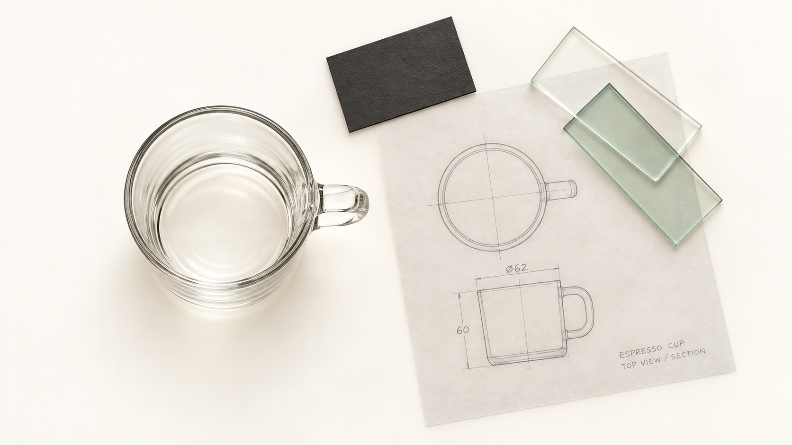

实际像素：1672×941；来源版本：v1；核心视觉复查：PASS。

[方向](../assets/examples/real-objects-20260913/01-glass-cup/landscape/direction.json) · [实际任务](../assets/examples/real-objects-20260913/01-glass-cup/landscape/image-job.json) · [生成记录](../assets/examples/real-objects-20260913/01-glass-cup/landscape/generation-record.json) · [视觉复查](../assets/examples/real-objects-20260913/01-glass-cup/landscape/visual-review.md)

### 竖幅 · 9:16

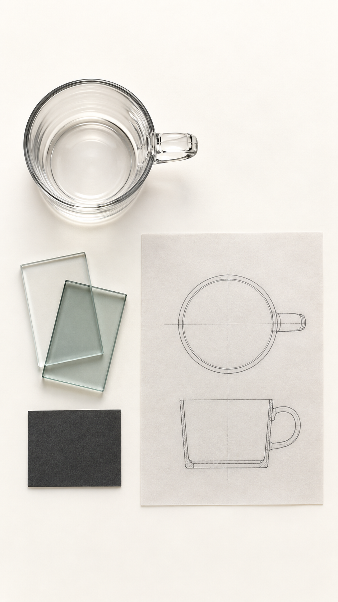

实际像素：941×1672；来源版本：v2；核心视觉复查：PASS。

[方向](../assets/examples/real-objects-20260913/01-glass-cup/portrait/direction.json) · [实际任务](../assets/examples/real-objects-20260913/01-glass-cup/portrait/image-job.json) · [生成记录](../assets/examples/real-objects-20260913/01-glass-cup/portrait/generation-record.json) · [视觉复查](../assets/examples/real-objects-20260913/01-glass-cup/portrait/visual-review.md)

## 02 · 咖啡勺轮廓与纸层研究

观察现实咖啡勺的凹勺碗、勺颈和长柄，以及对应的石墨轮廓、勺碗截面和纸层关系。

### 横幅 · 16:9

实际像素：1672×941；来源版本：v1；核心视觉复查：PASS。

[方向](../assets/examples/real-objects-20260913/02-spoon-paper/landscape/direction.json) · [实际任务](../assets/examples/real-objects-20260913/02-spoon-paper/landscape/image-job.json) · [生成记录](../assets/examples/real-objects-20260913/02-spoon-paper/landscape/generation-record.json) · [视觉复查](../assets/examples/real-objects-20260913/02-spoon-paper/landscape/visual-review.md)

### 竖幅 · 9:16

实际像素：941×1672；来源版本：v2；核心视觉复查：PASS。

[方向](../assets/examples/real-objects-20260913/02-spoon-paper/portrait/direction.json) · [实际任务](../assets/examples/real-objects-20260913/02-spoon-paper/portrait/image-job.json) · [生成记录](../assets/examples/real-objects-20260913/02-spoon-paper/portrait/generation-record.json) · [视觉复查](../assets/examples/real-objects-20260913/02-spoon-paper/portrait/visual-review.md)

## 03 · 瓷杯色场主视觉

观察完整白瓷杯与杯碟的同心结构、侧把和接触，比较灰蓝桌面与白瓷的面积关系；杯内盛有咖啡。

### 横幅 · 16:9

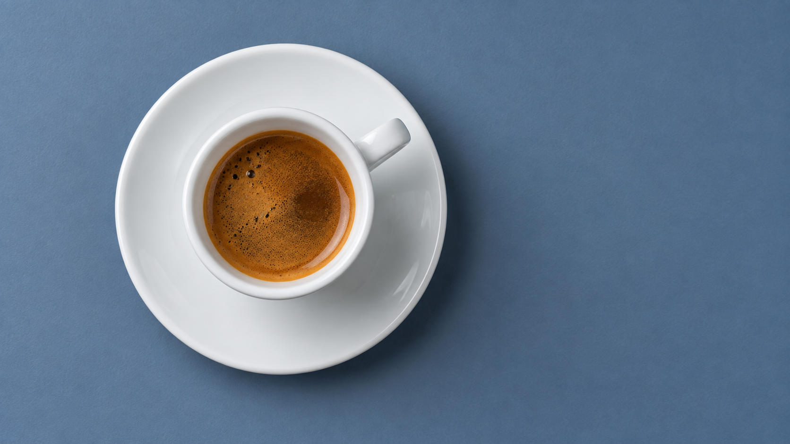

实际像素：1672×941；来源版本：v1；核心视觉复查：PASS。

[方向](../assets/examples/real-objects-20260913/03-porcelain-cup/landscape/direction.json) · [实际任务](../assets/examples/real-objects-20260913/03-porcelain-cup/landscape/image-job.json) · [生成记录](../assets/examples/real-objects-20260913/03-porcelain-cup/landscape/generation-record.json) · [视觉复查](../assets/examples/real-objects-20260913/03-porcelain-cup/landscape/visual-review.md)

### 竖幅 · 9:16

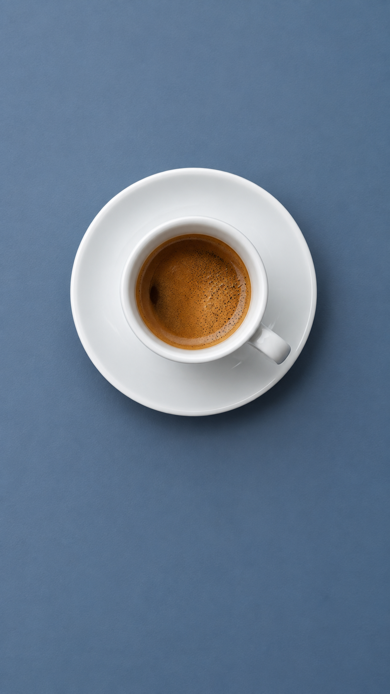

实际像素：941×1672；来源版本：v1；核心视觉复查：PASS。

[方向](../assets/examples/real-objects-20260913/03-porcelain-cup/portrait/direction.json) · [实际任务](../assets/examples/real-objects-20260913/03-porcelain-cup/portrait/image-job.json) · [生成记录](../assets/examples/real-objects-20260913/03-porcelain-cup/portrait/generation-record.json) · [视觉复查](../assets/examples/real-objects-20260913/03-porcelain-cup/portrait/visual-review.md)

## 04 · 咖啡勺描绘操作

观察稳纸手、握笔手与石墨笔尖的实际接触，以及完整实物、主图稿和下层研究的对应。

### 横幅 · 16:9

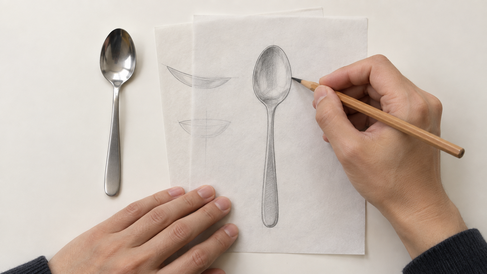

实际像素：1672×941；来源版本：v1；核心视觉复查：PASS。

[方向](../assets/examples/real-objects-20260913/04-spoon-drawing/landscape/direction.json) · [实际任务](../assets/examples/real-objects-20260913/04-spoon-drawing/landscape/image-job.json) · [生成记录](../assets/examples/real-objects-20260913/04-spoon-drawing/landscape/generation-record.json) · [视觉复查](../assets/examples/real-objects-20260913/04-spoon-drawing/landscape/visual-review.md)

### 竖幅 · 9:16

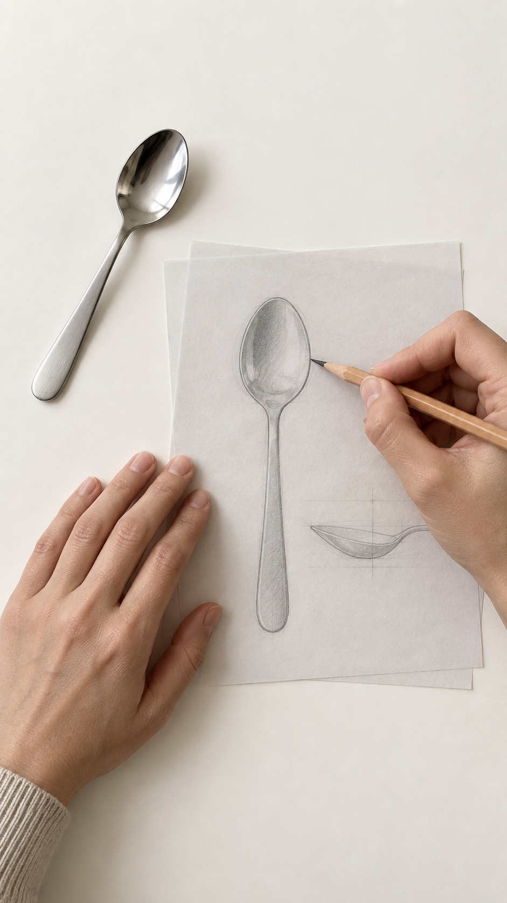

实际像素：941×1672；来源版本：v2；核心视觉复查：PASS。

[方向](../assets/examples/real-objects-20260913/04-spoon-drawing/portrait/direction.json) · [实际任务](../assets/examples/real-objects-20260913/04-spoon-drawing/portrait/image-job.json) · [生成记录](../assets/examples/real-objects-20260913/04-spoon-drawing/portrait/generation-record.json) · [视觉复查](../assets/examples/real-objects-20260913/04-spoon-drawing/portrait/visual-review.md)

## 05 · 咖啡勺表面近摄

近看完整咖啡勺的连续凹面反射、薄边、收窄勺颈与细拉丝长柄，保持现实器物的整体辨识。

### 横幅 · 16:9

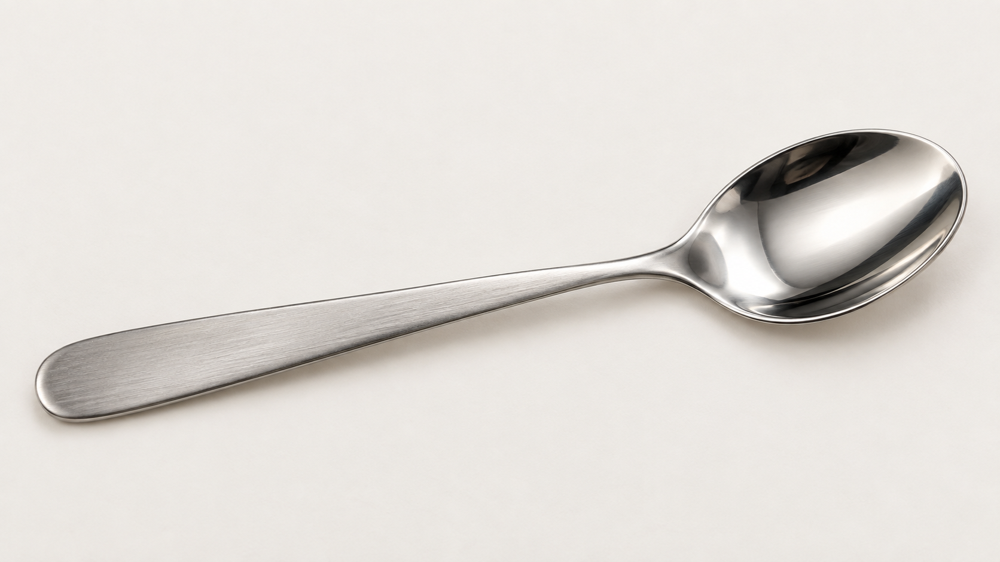

实际像素：1672×941；来源版本：v1；核心视觉复查：PASS。

[方向](../assets/examples/real-objects-20260913/05-spoon-finish-detail/landscape/direction.json) · [实际任务](../assets/examples/real-objects-20260913/05-spoon-finish-detail/landscape/image-job.json) · [生成记录](../assets/examples/real-objects-20260913/05-spoon-finish-detail/landscape/generation-record.json) · [视觉复查](../assets/examples/real-objects-20260913/05-spoon-finish-detail/landscape/visual-review.md)

### 竖幅 · 9:16

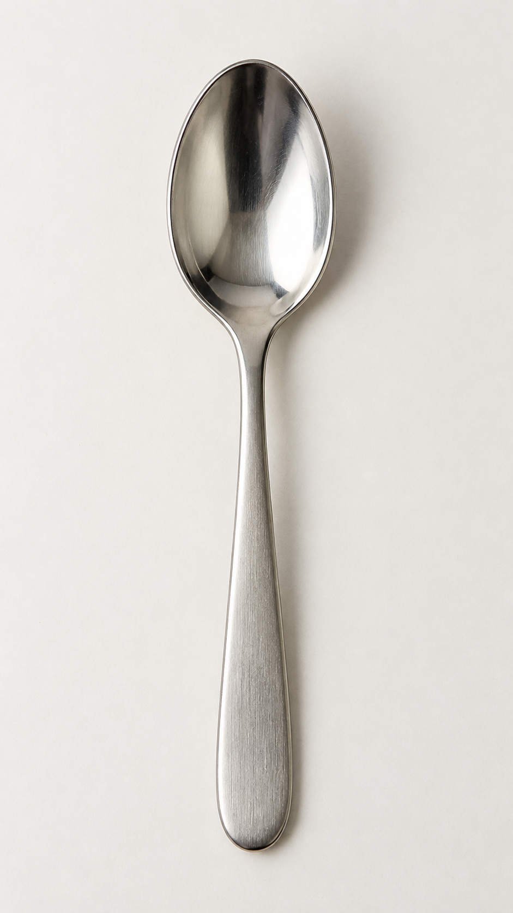

实际像素：941×1672；来源版本：v1；核心视觉复查：PASS。

[方向](../assets/examples/real-objects-20260913/05-spoon-finish-detail/portrait/direction.json) · [实际任务](../assets/examples/real-objects-20260913/05-spoon-finish-detail/portrait/image-job.json) · [生成记录](../assets/examples/real-objects-20260913/05-spoon-finish-detail/portrait/generation-record.json) · [视觉复查](../assets/examples/real-objects-20260913/05-spoon-finish-detail/portrait/visual-review.md)

## 06 · 咖啡勺工艺比较

比较现实咖啡勺、抛光和拉丝钢样、石墨排线；小覆盖纸作用于实际排线，显示清楚的覆盖差别。

### 横幅 · 16:9

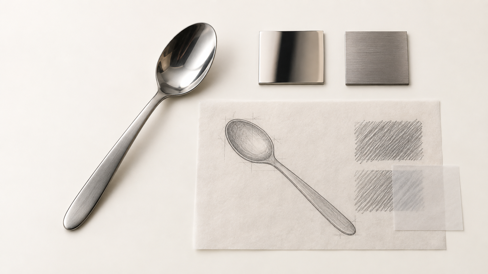

实际像素：1672×941；来源版本：v1；核心视觉复查：PASS。

[方向](../assets/examples/real-objects-20260913/06-spoon-finish-comparison/landscape/direction.json) · [实际任务](../assets/examples/real-objects-20260913/06-spoon-finish-comparison/landscape/image-job.json) · [生成记录](../assets/examples/real-objects-20260913/06-spoon-finish-comparison/landscape/generation-record.json) · [视觉复查](../assets/examples/real-objects-20260913/06-spoon-finish-comparison/landscape/visual-review.md)

### 竖幅 · 9:16

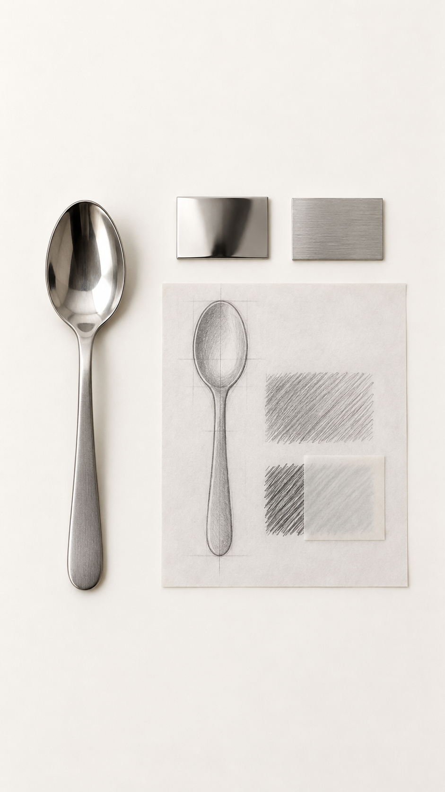

实际像素：941×1672；来源版本：v2；核心视觉复查：PASS。

[方向](../assets/examples/real-objects-20260913/06-spoon-finish-comparison/portrait/direction.json) · [实际任务](../assets/examples/real-objects-20260913/06-spoon-finish-comparison/portrait/image-job.json) · [生成记录](../assets/examples/real-objects-20260913/06-spoon-finish-comparison/portrait/generation-record.json) · [视觉复查](../assets/examples/real-objects-20260913/06-spoon-finish-comparison/portrait/visual-review.md)

## 07 · 手持咖啡勺图稿

观察双手对同一纸张的支撑、轻微弯曲与高差；下层椭圆研究横过上层纸边界，露出与被覆部分可直接比较。

### 横幅 · 16:9

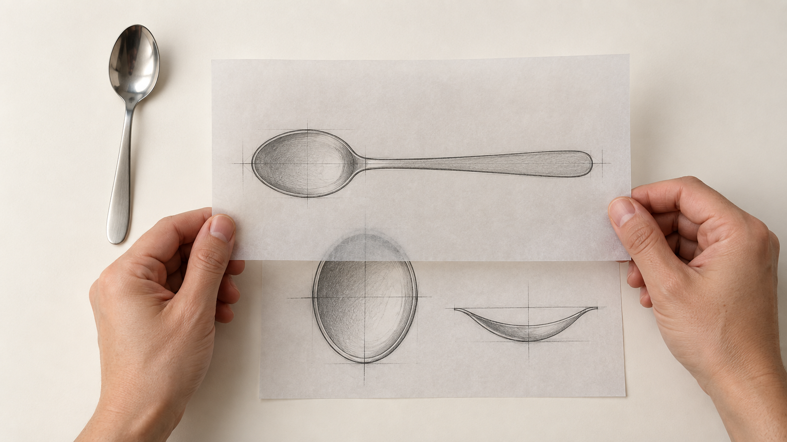

实际像素：1672×941；来源版本：v2；核心视觉复查：PASS。

[方向](../assets/examples/real-objects-20260913/07-held-spoon-study/landscape/direction.json) · [实际任务](../assets/examples/real-objects-20260913/07-held-spoon-study/landscape/image-job.json) · [生成记录](../assets/examples/real-objects-20260913/07-held-spoon-study/landscape/generation-record.json) · [视觉复查](../assets/examples/real-objects-20260913/07-held-spoon-study/landscape/visual-review.md)

### 竖幅 · 9:16

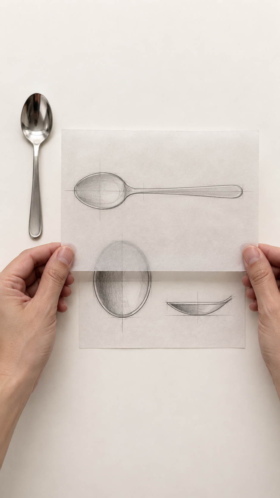

实际像素：941×1672；来源版本：v2；核心视觉复查：PASS。

[方向](../assets/examples/real-objects-20260913/07-held-spoon-study/portrait/direction.json) · [实际任务](../assets/examples/real-objects-20260913/07-held-spoon-study/portrait/image-job.json) · [生成记录](../assets/examples/real-objects-20260913/07-held-spoon-study/portrait/generation-record.json) · [视觉复查](../assets/examples/real-objects-20260913/07-held-spoon-study/portrait/visual-review.md)

## 08 · 棉纸字形压纹近景

观察常规衬线 A 的完整字形、棉纸浅压纹、纤维、切边与侧向软光，比较主体纸卡和背衬纸的厚度关系。

### 横幅 · 16:9

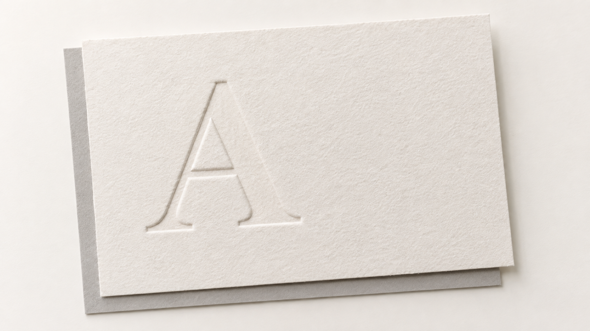

实际像素：1672×941；来源版本：v1；核心视觉复查：PASS。

[方向](../assets/examples/real-objects-20260913/08-cotton-paper-embossing/landscape/direction.json) · [实际任务](../assets/examples/real-objects-20260913/08-cotton-paper-embossing/landscape/image-job.json) · [生成记录](../assets/examples/real-objects-20260913/08-cotton-paper-embossing/landscape/generation-record.json) · [视觉复查](../assets/examples/real-objects-20260913/08-cotton-paper-embossing/landscape/visual-review.md)

### 竖幅 · 9:16

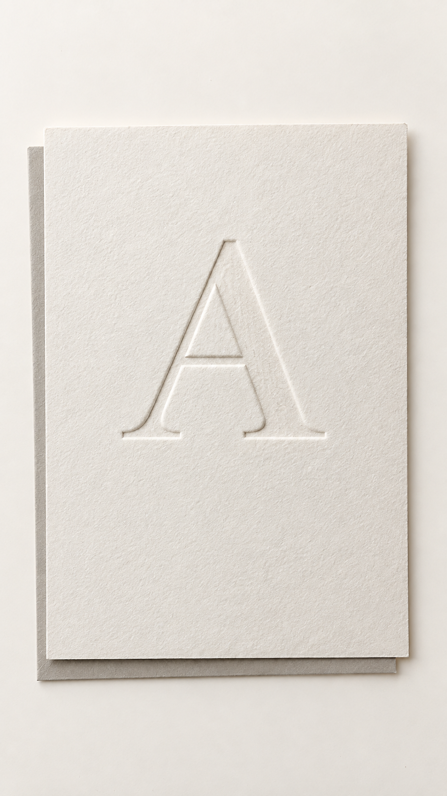

实际像素：941×1672；来源版本：v1；核心视觉复查：PASS。

[方向](../assets/examples/real-objects-20260913/08-cotton-paper-embossing/portrait/direction.json) · [实际任务](../assets/examples/real-objects-20260913/08-cotton-paper-embossing/portrait/image-job.json) · [生成记录](../assets/examples/real-objects-20260913/08-cotton-paper-embossing/portrait/generation-record.json) · [视觉复查](../assets/examples/real-objects-20260913/08-cotton-paper-embossing/portrait/visual-review.md)

## 09 · 柔光箱透光纸层研究

观察铺满画面的乳白柔光箱扩散面；连续石墨轮廓穿过小覆盖纸，在单层与叠层区域呈现明确的透光差别。

### 横幅 · 16:9

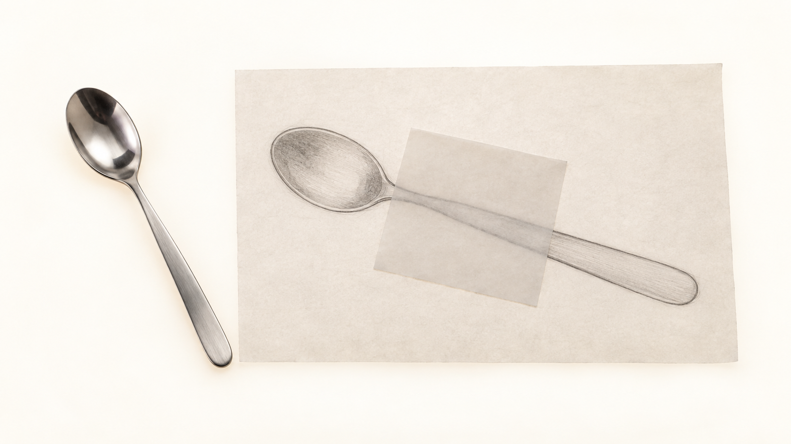

实际像素：1672×941；来源版本：v1；核心视觉复查：PASS。

[方向](../assets/examples/real-objects-20260913/09-softbox-paper-study/landscape/direction.json) · [实际任务](../assets/examples/real-objects-20260913/09-softbox-paper-study/landscape/image-job.json) · [生成记录](../assets/examples/real-objects-20260913/09-softbox-paper-study/landscape/generation-record.json) · [视觉复查](../assets/examples/real-objects-20260913/09-softbox-paper-study/landscape/visual-review.md)

### 竖幅 · 9:16

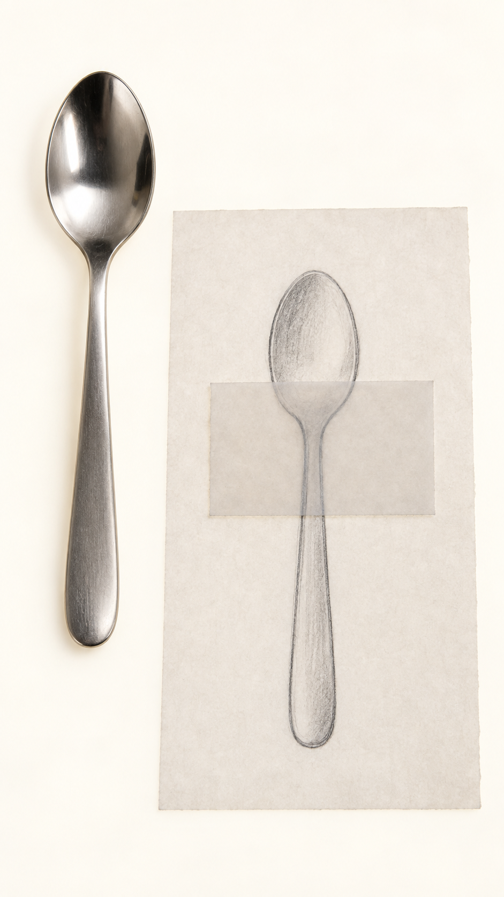

实际像素：941×1672；来源版本：v1；核心视觉复查：PASS。

[方向](../assets/examples/real-objects-20260913/09-softbox-paper-study/portrait/direction.json) · [实际任务](../assets/examples/real-objects-20260913/09-softbox-paper-study/portrait/image-job.json) · [生成记录](../assets/examples/real-objects-20260913/09-softbox-paper-study/portrait/generation-record.json) · [视觉复查](../assets/examples/real-objects-20260913/09-softbox-paper-study/portrait/visual-review.md)
